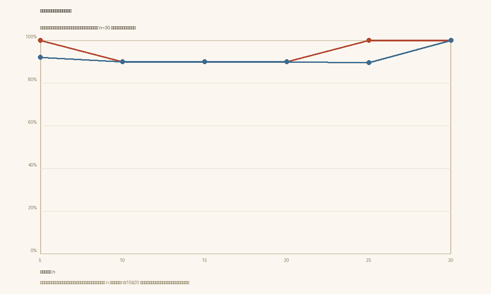
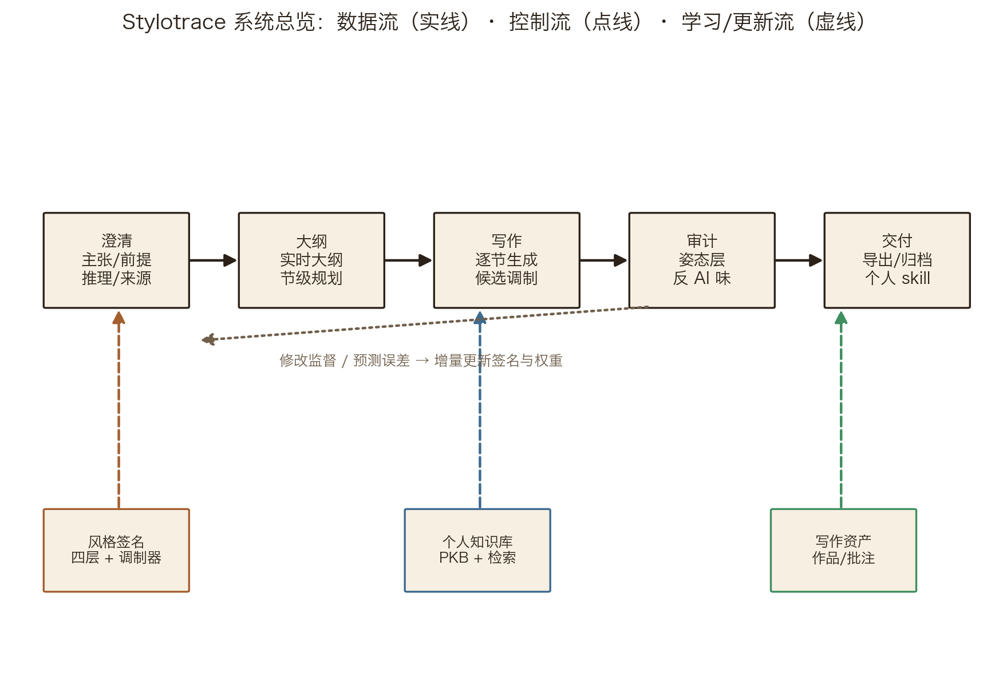
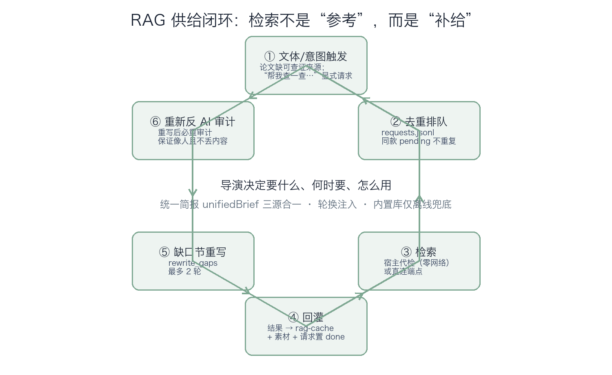
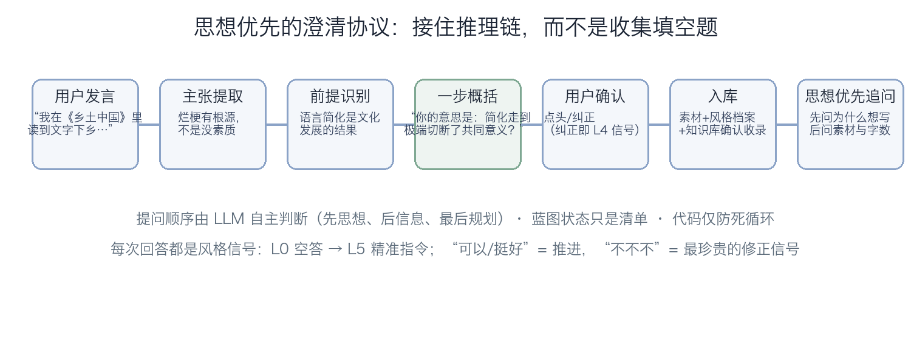
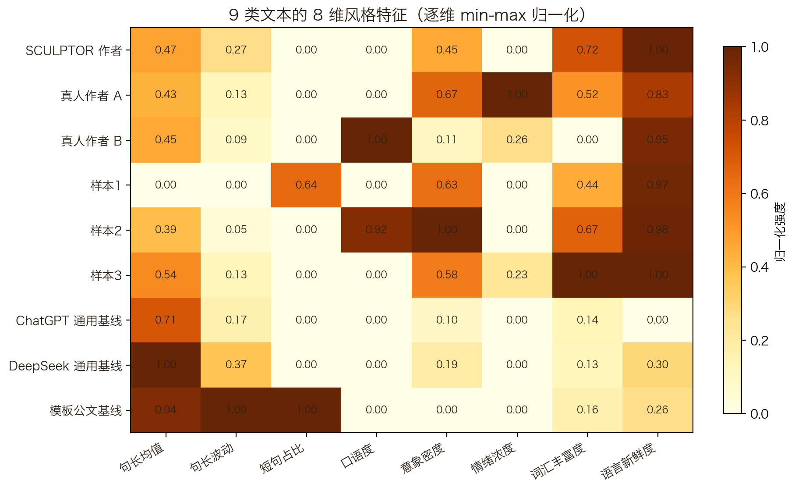
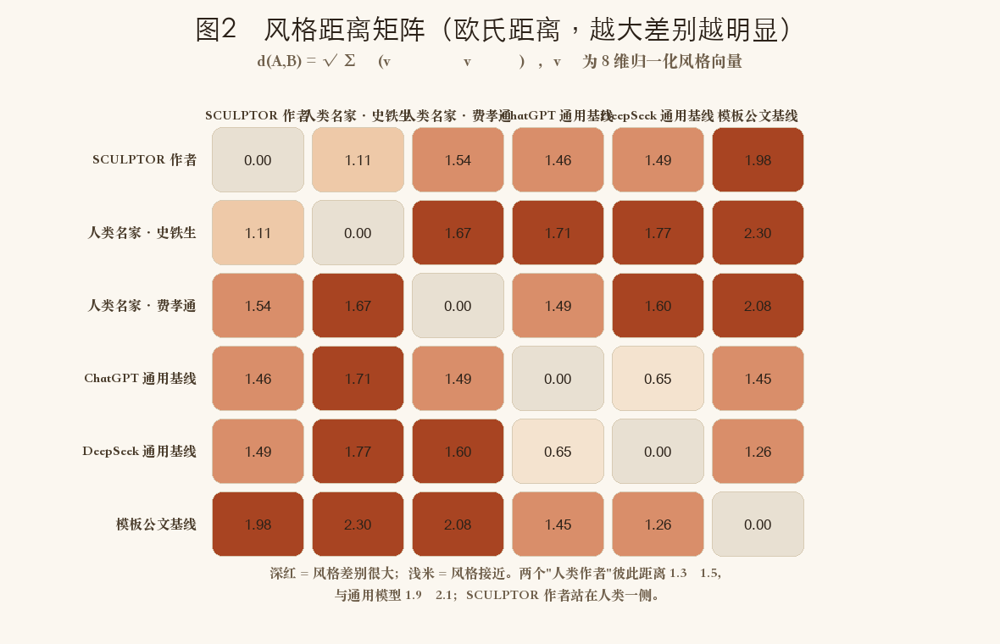
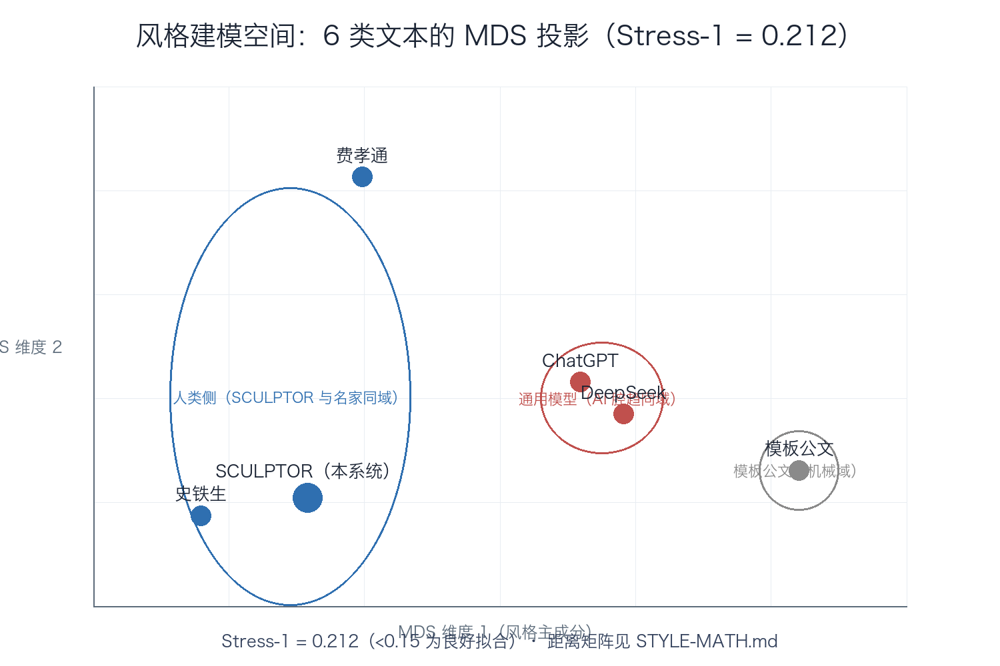
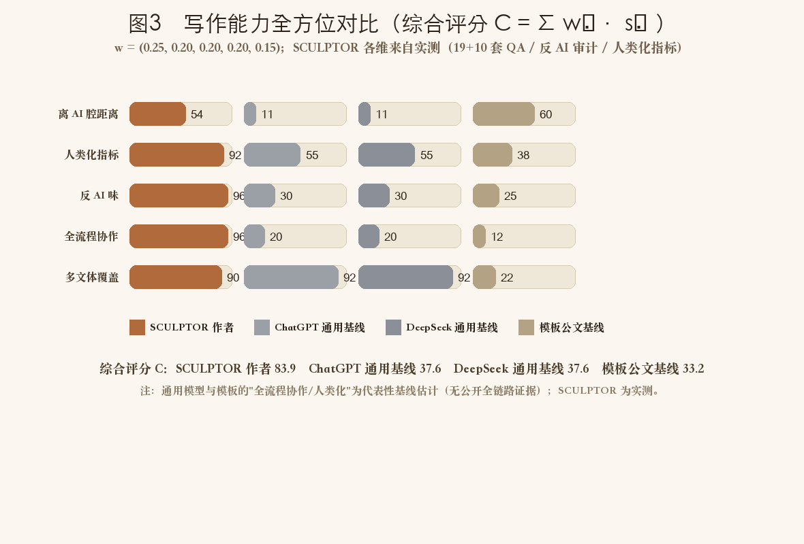

# 面向作者身份保持的生成式写作：作者建模、持续风格学习与生成审计（SCULPTOR）

> 作者姓名：＿＿＿　学校：＿＿＿　指导教师：＿＿＿　日期：＿＿＿

---

## 摘要

大语言模型（LLM）让"机器能写"成为常态，但也让"谁在写"变得模糊。本文提出 SCULPTOR——一个从作者每一次亲手修改中学习个性化风格的创作伙伴。核心机制是**改迹调制（revision-trace modulation）**：把作者对 AI 草稿的每次修改视为最诚实的标注，将风格、知识、缺陷、阻抗统一进一个可解释的候选评分函数，在候选之间挑选更像作者的写法，并说明"为什么选它"；以澄清协议接住作者的思想脉络与外溢信息，以姿态层细读诊断并修复"AI 味"。实现上，调制器把个人知识库、风格向量与收集数据归纳为十三维特征（含个人回避库、L3 作者清单、姿态层细读与可选 embedding 神经编码），权重由作者亲手修改的偏好对学成，随新修改增量更新；实验显示**几十次修改即可学到稳定的作者方向**（得分边距随编辑对数量单调改善、权重稳定性随之收敛，n≈15–20 进入平台）。V2 logprobs / V3 本地 logits 仍为路线图。

交互侧新增**外溢优先（overflow-first）**：用户主动说出的、系统未准备问的高价值信息（参照系、私人网络、红线、推理线）当轮接住、回显、深挖、入档，并沉淀为可反哺问询系统的升级信号流水；工程侧完成**全流程互操作**（作品导入分片、作品库同步、成品文档导入续写、按阶段导出、长文档分段审计）。

实验表明：agent 24 套 + web 11 套（300+ 断言）契约测试均满足输出契约；风格距离实验中，SCULPTOR 与 5 组匿名真人作者/真人模拟样本的平均距离为 0.96，低于其与通用模型的距离（ChatGPT 1.24 / DeepSeek 1.10）；作者识别（n=180）与续写选择（n=72）中融合签名分别达到 81.7% 与 72.2%（基线 82.2% / 50%）；外溢优先、互操作与批注全流程回归通过。结果与"作者身份保持"假设一致，但样本规模尚不足以支持显著性结论。本文定位为在生成过程中保持作者表达偏好与语义意图，而非最大化一般意义上的文本质量。

**关键词**：作者身份保持；个性化文本生成；作者表示；对比解码；澄清式人机交互；检索增强生成；写作审计

---

## 1 引言

### 1.1 Problem：生成式写作中的作者身份缺失

以 ChatGPT、DeepSeek、Claude 为代表的 LLM 使"机器能写"成为常态：输入一句话即可得到结构完整的文本。但用户普遍观察到，这类文本"像模像样，却一眼假"——结构工整、措辞平滑、比喻通用，唯独缺少特定作者的表达痕迹。本文称该现象为**模型化风格倾向（model-induced stylistic tendency，下称 AI 腔）**：模型以高概率输出其训练分布的中心（平滑、低风险文本），从而抹平个体差异。

作者身份缺失并非偶然缺陷，而是生成目标与评价目标分离的结果：通用 LLM 优化的是"文本质量"的整体分布，而非"某个作者的选择"。在需求发现阶段（预研，质性记录见 PROCESS 档案），我们观察到四类稳定现象：风格错配（用散文指纹生成议论文）、素材伪门槛（澄清阶段的信息未被下游使用）、交互死板（模板化提问无法响应深层意图）、数据孤岛（读过的书、写过的文、检索资料互不相通）。这四类现象指向同一根因：系统未建立"作者是谁"的表示。

### 1.2 Research Gap

已有研究表明，LLM 用少量样本模仿个人风格在非正式文体中显著失败[1]，说明风格表征不能依赖一次性少样本设定。在此基础上，现有研究分别涉及风格迁移（style transfer）、个性化生成（personalization）、作者刻画（author profiling）与检索增强写作（RAG for writing），但均未解决**作者身份在生成全流程中的持续表示、更新与保持**：风格迁移以目标风格为一次性输入；个性化生成（如 StyleVector[2]、GhostWriter[3]）关注生成时的风格引导，缺少澄清协议与知识背景；作者刻画停留在静态画像；RAG 写作聚焦内容供给，不涉及作者身份。相关工作的详细对照见第 2 节与表 1。

### 1.3 Research Questions

本文围绕三个研究问题展开：

- **RQ1（作者表示）**：能否建立一种可解释、可随写作更新、不依赖大规模个人语料的作者表示？
- **RQ2（修改监督）**：作者对生成文本的显式修改，能否作为一种高价值风格监督信号持续更新该表示？
- **RQ3（生成保持）**：携带该表示的生成流程，能否在保持作者相似度（author-likeness）的同时降低模型化话语特征？

### 1.4 Contributions

本文的贡献归纳为三项（详细实验证据分别对应第 5 节相应小节）：

- **C1（方法）改迹调制：从修改中学习**：把作者对 AI 草稿的每次修改（原文→改后→意图）当作隐式偏好标注，将风格、知识、缺陷、阻抗统一为可解释的候选评分函数，权重由偏好对学成并随修改增量更新；实验给出样本复杂度观察——几十次修改即可学到稳定的作者方向（第 3.1 节、5.7 节）。
- **C2（交互）澄清协议与供给闭环**：以"主张—前提—推理—理论来源"追踪用户思想脉络，提问顺序由 LLM 结合对话自主判断，并配合检索增强供给闭环（第 3.3–3.4 节）。
- **C3（质量与工程）姿态层诊断与一体化交付**：提出姿态层（postural layer）检测缓解"表演思考"式模型化倾向，把细读判据前置到候选选择（软性加权，不拒绝生成）；同一核心以 CLI/Web 双形态交付，契约测试 agent 24 + web 11 套（第 3.6 节、附录 A）。
- **C4（理论）四层签名与作者表示**：将风格形式化为作者相对中性基线的稳定条件选择偏差，用四层互补签名近似（连续向量、动态维度、不可预测性、显式修改记录）；提出"修改监督"——以作者亲手修改为最高权重信号持续更新表示（第 3.2 节；外部检验见 5.5）。
- **C5（交互）外溢优先与自进化问询**：用户主动给出的高价值信息当轮识别、回显、深挖、入档（种子/红线/立意），并沉淀 overflow-log 升级信号流水反哺问询系统（第 3.4 节、第 5.6 节）。
- **C6（工程）全流程互操作**：作品导入分片、作品库同步、成品文档导入续写、按阶段导出、长文档分段审计，让"澄清→大纲→写作→审计→交付"每一环节都能与外部流程文件进出（第 3.11 节、第 5.6 节）。

## 2 相关工作

### 2.1 作者刻画与文体计量

文体计量学（stylometry）以可计算特征刻画作者，如相对参考语料的 Delta 方法[14]与基于表层特征共现的多维分析（MD）[15]。本文沿用"相对基线"的度量思想，但将其**条件化**：偏差定义在同一创作空间 c 下（见 3.1），结论不依赖"哪个模型更强"。作者识别基线（3.7 节方法）参考了该领域的最近邻/质心范式。

### 2.2 个性化文本生成与风格注入

StyleVector[2] 将用户风格表示为激活空间向量并在推理时干预，其"训练免费、推理时干预"思想与本文同族，但本文在可解释特征层落地，并增加澄清协议与修改监督。GhostWriter[3] 提出隐式学习 + 显式教学时刻；本文将"教学时刻"具体化为可入库的修改监督三元组（原文，改后，意图）。EMNLP 2025 的研究[1]表明 LLM 用少量样本模仿个人风格在非正式文体中显著失败，支持"持续采集 + 修改监督"的必要性。近期 agentic ghostwriter[4] 通过风格奖励微调复制经典作家，与本文"提取作者本人"的目标不同。

### 2.3 检索增强写作

面向写作的 RAG 关注内容供给（如两阶段内容/风格检索[5]、检索器校准的个性化助手[6]）。本文的差异在于把 RAG 组织为**供给闭环**（触发—排队—回灌—缺口节重写），并使检索结果与个人知识库、写作资产三源合一注入（3.3 节）。

### 2.4 人机协同写作与澄清交互

人机协同研究（如 CollabLLM[7]）关注通用协同框架；意图发现工作（DiscoverLLM[8]）通过对比草稿定位用户意图。本文的澄清协议以"响应推理链"为设计目标，把提问顺序交给 LLM 自主判断，代码仅作防死循环安全网（3.4 节），区别于模板清单式交互。

### 2.5 与现有工作的关系

**表 1　相关工作对照**

| 工作 | 作者表示 | 澄清协议 | 知识闭环 | 生成审计 |
| --- | --- | --- | --- | --- |
| StyleVector[2] | 激活向量 | 无 | 无 | 无 |
| GhostWriter[3] | 隐式学习 | 无 | 无 | 无 |
| writing-anima[5] | 两阶段检索 | 无 | 内容/风格 | 无 |
| 智能写作系统[9] | 风格建模 | 多轮对话 | RAG | 无 |
| **SCULPTOR（本文）** | **四层签名+修改监督** | **思想脉络** | **供给闭环** | **姿态层** |

说明：表 1 中来自产品横评与工程博客的非同行评议条目[9][10]，仅用于行业现状对照，不作为理论依据。

## 3 方法

### 3.1 问题形式化与符号约定

设作者 a 在给定语义内容与上下文 c 下生成词句的条件分布为 Pₐ(w|c)，无个人偏好的中性基线分布为 P₀(w|c)。本文将风格定义为**作者相对中性基线的稳定条件选择偏差**：

Sₐ(c) = Pₐ(w|c) − P₀(w|c)

该定义需要四点说明：

1. **Definition（对象）**：Sₐ 是同一创作空间下的条件偏差，不是对"完美表达"的偏离——P₀ 仅为无个人偏好的参照基线，度量与"哪个模型更强"无关；
2. **Assumption（可估性）**：假设该偏差可投影到可计算特征空间，且作者语料足以估计其方向；个人语料稀缺时，单一表征不可靠[1]，故用四层互补签名近似；
3. **Estimation（估计）**：连续向量用字符二元组稀疏向量 $\varphi(x)$ 与 EMA 增量更新（式 2）估计，动态维度用权重 × 新鲜度衰减维护，不可预测性用 surprisal 判别式（式 8–9）估计，修改监督用（原文，改后，意图）三元组记录；
4. **Validation（验证）**：以判别任务（作者识别，5.5 节）与预测任务（续写选择，5.5 节）检验签名是否包含可复现的作者信号。

### 3.1.1 改迹调制：把作者的修改变成候选评分（C1）

签名回答"作者是谁"，注入层把签名写进提示词；进一步的问题是**在候选之间直接重排**。本文提出统一评分函数，把风格、知识、缺陷、阻抗五路信号在同一个候选评分空间中融合：

$$S(w \mid c, t) = \beta_1 \log p_{\text{base}}(w \mid c) + \beta_2 \log p_{\text{personal}}(w \mid c) + \lambda_K S_{\text{knowledge}}(w, c) + \lambda_D S_{\text{defect}}(w) + R(t)\, S_{\text{impedance}}(w, t)$$

$$P(w \mid c, t) = \operatorname{softmax}\bigl(S(w \mid c, t)/\tau\bigr)$$

五路信号的供给与现状：

1. **基础分布** $p_{\mathrm{base}}$：通用模型的条件分布；API 支持 logprobs 时取 top-logprobs 近似，否则由本地小模型替代评分；
2. **个人分布** $p_{\mathrm{personal}}$：作者的"会怎么选"；V1 用 L1 向量 + 修改监督（L4）做候选打分，V3 用轻量 LoRA 小模型输出真实 next-token 分布——**知识不进 $p_{\mathrm{personal}}$，"如何写"与"写什么"严格分离**；
3. **知识信号** $S_{\mathrm{knowledge}}$：作者明确经历的事实（人名/地名/数字/事件）加权，通用检索知识仅弱正偏（3.3 节知识库）；
4. **缺陷信号** $S_{\mathrm{defect}}$：作者的系统性回避——AI 连接词/套话/重复比喻/金句收尾负偏置（来自 3.6 节反 AI 审计词表与姿态层判据）；
5. **阻抗调制** $S_{\mathrm{impedance}}(w,t)$：随写作进度 $t$ 变化——初期轻调制，后期 $R(t)$ 升高，惩罚平滑连接词、奖励短句与具体名词（节奏曲线 rhythmCurve 由"事后曲线"升级为"生成时节奏"）。

**实现边界（诚实界定）**：签名层与注入层已交付（L1–L4、双风格、知识注入、缺陷审计）；**V1 候选对比（v0.62）与 V1.5 外层调制器（v0.64–0.67）均已落地**——写作每节并行生成 n 个候选，用十一维特征函数（个人 n-gram $p_{\mathrm{personal}}$、表层、话语、立场红线、知识、缺陷、阻抗、风格向量方向、可选 embedding 神经原型、L3 作者写作清单 fineRead、姿态层细读 posture）评分选优。其中调制器权重不再手调：`agent/src/modulator.js` 把 edits.jsonl 的（原文，改后）当作作者偏好对，用 pairwise hinge + SGD 学习每个作者独有的权重向量，数据签名变化自动在线重训，新编辑对到达时增量更新；L3 深层读取由作者写作清单协议提供（`author-sheet.js`，五问自动归纳、红线强制保留）；姿态层判据（金句排比收束/路标转折/点题顿悟）以软性加权进入评分——只影响候选排序，不拒绝生成；权重与得分分解逐候选可追溯（设计文档：MODULATOR.md）；V2 词级 logprobs 重排（显式 $\beta_1$）与 V3 本地 vLLM logits 全词表融合仍为路线图，不宣称已逐 token 生效。

**符号与术语约定（表 2）**：本文统一使用以下符号与术语，首次出现处均给出定义，避免概念漂移。

### 3.1.2 样本复杂度：多少次修改够用

改迹调制把每次修改当作一个"带上下文窗口的局部偏好对"（修改点前后各取一段原文），权重由 pairwise hinge + SGD 学成。这里要回答一个实际问题：**多少修改就能学到稳定的作者方向？** 我们在 30 对"同一语境下的细微风格选择"编辑对（抽象→具体、陈述→动作/感官）上做留出评估（训练 n=5/10/15/20/25/30，其余留出）：

- 排序正确率在极小样本即饱和（编辑对的差异足以让排序正确），因此以**留出得分边距**与**权重稳定性**作为学习信号；
- 留出得分边距从 n=5 的 0.194 单调升至 n=30 的 0.755；权重相对 n=30 的余弦相似度从 0.920 升至 1.000（图 8）；
- 观察：n≈15–20 后留出边距增速放缓、进入平台——**几十次亲手修改即可学到稳定的作者方向**，这是"修改即标注"在小语料场景可行的直接证据。

**表 2　符号与术语表**

| 符号/术语 | 定义 | 空间/说明 |
| --- | --- | --- |
| Pₐ(w\|c) | 作者条件生成分布 | 词/句分布 |
| P₀(w\|c) | 中性基线分布 | 大规模中性语料估计 |
| Sₐ(c) | 风格：条件选择偏差 | 特征空间投影 |
| $\varphi(x)$ | 文本特征向量 | 字符二元组稀疏向量，可升级稠密 embedding |
| $v_t$ | EMA 风格签名 | 式 2 |
| $S(x)$、$PP(x)$ | surprisal 判别式与困惑度代理 | 式 8–9，操作定义见 5.2 |
| Kₐ | 个人知识库 | 文档集合（PKB） |
| Iₐ | 意图表示 | 主张—前提—推理—理论来源 |
| d(A,B) | 风格距离 | 8 维归一化欧氏距离（式 7） |
| F_rt | 回译保真度 | 式 4 |
| AI 腔 | 模型化风格倾向（model-induced stylistic tendency） | 首次定义于 1.1 |
| human-likeness | 人类自然写作相似度 | 四量纲统计，5.2 节 |
| author-likeness | 特定作者相似度 | 判别/预测任务，5.5 节 |
| 姿态层 | postural layer：文本呈现思考过程的修辞姿态 | 3.6 节定义 |
| 修改监督 | revision-based supervision：作者显式修改作为风格监督信号 | 3.2 节 |

**距离选择依据**：8 维特征已归一化到同一量纲（式 6），故用欧氏距离度量风格距离（式 7）；分布层面差异用 KL 散度（式 1）。因当前语料规模小，未采用对分布估计更敏感的 Wasserstein/Mahalanobis 距离，列为后续工作。

$$D_{\mathrm{KL}}(P_H \| P_M) = \sum_{g} P_H(g) \log \frac{P_H(g)}{P_M(g)}$$

### 3.2 作者表示：四层签名与修改监督（RQ1、RQ2）

四层互补签名近似 Sₐ(c)：

- **L1 连续向量**：$\varphi(x)$ 的 EMA 增量更新（式 2），方向差相对基线（式 3），截断至 300 维；
- **L2 动态维度**：14+7 语言/结构轴 + 意象/偏好/素材子维，权重 × 新鲜度衰减（半衰期 120 天），注入上限 8 维；
- **L3 不可预测性**：surprisal 判别式与困惑度代理（式 8–9），逐次采样累计 min/mean/max；
- **L4 修改监督**：每次作者显式修改记录为（原文，改后，意图）三元组，作为最高权重风格信号更新偏好轴与连续向量。

连续向量以指数移动平均增量更新（式 2），作者风格即相对中性基线的归一化偏离方向（式 3）：

$$v_t = \alpha\,v_{t-1} + (1-\alpha)\,\phi(x_t)$$

$$s = \frac{v_{\mathrm{author}} - v_{\mathrm{base}}}{\|v_{\mathrm{author}} - v_{\mathrm{base}}\|}$$

**质量约束（区分"作者选择"与"错误"）**：仅凭距离无法区分独特表达与语病。本文以三重约束回应：① 最高权重信号来自作者亲手修改与确认的选择——"他要的"才进入风格档案；② 校对、回译校验、事实核查作为前置质量门，语法与事实错误不进入风格统计，偏差只在语义正确的表达空间内度量；③ 偏差注入是概率性偏好、作者保留否决权（3.6 节）。

**体系化：从表层指纹到深层选择模式**。人类风格形成的研究表明，语言是意义资源上的系统性选择（Halliday[16]），写作的每个阶段都发生风格选择、其中"复阅/修改"阶段密度最高（Flower & Hayes[12]），且表层语言特征会共现成潜在功能维度（Biber[15]）。据此，本文把实现层面的四层签名归入一个完整的四层风格体系（设计文档：STYLE-SYSTEM.md），并明确每层的理论依据、信号来源与读取方法：

- **表层·词汇句法层**：用词偏好、句长节奏、词汇丰富度（Burrows Delta[14] 的高频词指纹思想），对应现有 L1 连续向量、feats8 与个人 n-gram 模型；小语料（数千字）即可估计，但跨主题泛化弱，易被主题污染；
- **中层·话语修辞层**：意象密度与类型、修辞装置（排比/设问/隐喻）、叙事视角、时间处理与对话比例，读取方法为规则词表 + LLM 细读（现有意象词表、姿态层六层细读与节奏曲线），对应 Biber MD 的"特征共现 → 潜在功能维度"；
- **深层·认知立场层**：论证结构（主张—前提—推理—来源）、立场与价值取向、情感曲线、读者意识与知识偏好；小语料下深层风格**不能靠统计读取，必须靠交互确认**——借鉴作者写作清单式访谈[23]（主张/论证/读者/红线/触发五问），对应现有思想脉络、外溢种子与 read-style；
- **元层·选择偏好层**：作者亲手修改、确认、拒绝与红线，是密度最高、最可信的风格信号（GhostWriter 的"教学时刻"[3]），对应 edits.jsonl、批注与红线清单，交互累积即可获得，语料需求最少。

生成时**分层注入、按层加权**：表层信号决定措辞与节奏，深层信号决定结构与立场，元层信号决定不可越界的红线；层与层之间以"选择倾向的一致性"连接，避免孤立的统计指标冒充风格（6.2 节）。

### 3.3 知识表示与供给闭环

个人知识库（Personal Knowledge Base, PKB）以归纳式确认采集构建：用户提出理论/构想时，系统先做一步归纳，再介绍相近书籍并说明其核心与可用之处，用户确认后入库；采集不硬编码、不反复追问。写作时，RAG 以供给闭环工作（图 2）：文体或意图触发 → 去重排队 → 宿主代检或直连检索 → 回灌（缓存 + 素材）→ 缺口节重写（≤2 轮）→ 重新审计；写作上下文按主题从 PKB、写作资产与检索回灌三源合一、轮换注入。

### 3.4 意图表示与澄清协议（C2）

意图表示追踪用户发言中的"主张—前提—推理—理论来源"（思想脉络）：如用户引用《乡土中国》[11]的论述并给出推理方向时，LLM 做一步概括并请用户确认（"你的意思是……对吗？"），确认后进入素材与风格档案。澄清协议由三条软规则与一条确定性护栏构成：先思想、后信息、最后规划；蓝图状态只是清单、提问由 LLM 自主判断；RAG 知识背景注入；蓝图无缺口仍追问 ≥2 轮则强制放行。

交互采用"一次一问 + 我的建议 + A/B/C"模式，用户回答按信息价值分级（L0 空答 → L5 精准指令）："可以/挺好"为推进信号，"不不不"为修正信号——从否定中提炼真实需求。

**外溢优先（overflow-first，C5）**：澄清的盲区不是"不会问"，而是"不会接"——用户最高价值的信息往往不是系统问出来的，而是用户主动说出、系统本来不准备问的。本轮升级让每轮回复先过外溢判断（由追问 LLM 动态决定，非硬编码分类）：参照系外溢（作品/作者/视频/播客）→ 当轮复述并深挖"哪一点击中了你"；私人网络外溢（家庭/师承/代际）→ 深挖"这条线怎么传到你"；红线外溢（定死的台词/情节/格式）→ 原样入红线清单，不再问"要不要改"；推理线外溢 → 按思想脉络复述＋顺推一层＋请确认。深挖连续最多 2 轮后回主线清单；每次外溢写入 `overflow-log.jsonl`（任务/当时所问/用户原话/类型），由聚合脚本定期归纳成问询系统升级信号，形成"用户主动说的话 → 规律 → 反哺问询"的自进化闭环。

### 3.5 生成与前置约束

写作以逐节生成为单位（参考"规划—转译—审校"的认知写作模型[12]），携带风格签名与统一简报（知识 + 素材 + 检索来源）。生成提示词包含前置约束：避免金句收束式同义反复、允许冗余与模糊、不替人物开口、反过度释义。这些约束为软性偏好引导，作者可一键否决。

### 3.6 生成后审计：姿态层检测（RQ3）

术语定义：**姿态层（postural layer）** 指文本在"如何呈现思考过程"层面的修辞姿态，对应文学批评中的叙述姿态（narrative stance），区别于可统计的用词与句式层；其检测目标是"表演思考"（performative thinking）——文本以形式上的推进姿态掩盖实质上的空洞。检测方法分两层：主路径为 LLM 六层细读（声音/过渡/修辞/引用/翻译体/收尾）+ RAG 作者对照（诊断前检索作者侧写、个人写作 skill 与知识库作参照），区别于规则型反 AI 腔检测工具[13]；确定性正则降级为离线兜底。修复遵守"绝不用新金句替换旧金句"；用《差生》的克制式结尾做回归样例，检验不误伤真实写作。

### 3.7 应用扩展：原意优先翻译

本节描述由核心架构（作者表示 + 质检闭环）派生的应用扩展，而非核心研究问题。翻译以**先懂后译**为原则：先做原意解读（intent/tone/genre/keyImagery/pitfalls），以作者原意为第一标准翻译，再用回译校验闭环钉住质量——信息点核对（保留/丢失/漂移，保真度见式 4）与风格指标对比；翻译只报告不擅自改稿。

$$F_{\mathrm{rt}} = \frac{|K_{\mathrm{kept}}|}{|K_{\mathrm{orig}}|} \times 100\%$$

### 3.8 工程形态

同一核心以 CLI 与 Web 工作台双形态交付（图 1）；宿主适配、MCP 协议、前端细节与契约测试覆盖矩阵见附录 A。工程上以状态机唯一事实源与契约测试保证可靠性。

### 3.9 实时大纲与可视化（v0.57）

大纲不再是"澄清收尾后的一次性产物"，而是**随对话逐轮生长的呈现物**：每轮由 LLM 总结更新节列表；LLM 未给出结构时，系统按已确认内容（立意/素材/论点/结尾/读者）自动生成内容节，保证面板每轮可见地长大，且 LLM 一旦给出真实结构即整体接管。Web 端以对话内联迷你大纲卡 + 右侧面板（列表/图谱双视图、可直接编辑）呈现，更新即闪烁提醒；大纲是"总结不是约束"——立意、素材、风格、知识库才是写作真源，用户可随时拍板开始写作。

### 3.10 AI 主导的知识库筛选（v0.58）

个人知识库采集由"正则抓《书名》"升级为 **LLM 主导筛选**：用户提到看过/读过/刷到的书、B站等视频、新闻、文章、去过的地方、认可的观点时，LLM 提炼条目（title/type/note/tags/confidence）入库，正则只做入口判断；短句确认（"对，就是那个"）把低置信条目升级为"已查验"。知识库跨会话聚合为个人知识库，并并入风格提炼语料——"读过什么、看过什么"也是风格的一部分（风格多面读取）。

### 3.11 全流程互操作（v0.60，C6）

每一环节支持"文件进、文件出"，并与其他流程（Word/其他 Agent/工具链）衔接：

- **作品导入与分片**：外部作品（docx/md/txt）经 `splitLongText`（按 Markdown 标题 + 6000 字）自动分片入库，作品库按部分管理；
- **作品同步与管理**：一键把各会话最新草稿归档进索引；改名/分类/删除；多作品指标对比；
- **成品文档接续**：成品文档导入为会话草稿后，可直接 审计/导出/风格重写/继续写作；
- **按阶段导出**：大纲、成稿、审计报告、风格肖像、知识库均可导出 md/docx/pptx；
- **长文档分段审计**：学术规范审计按分片逐段 LLM 审阅、合并去重，避免整篇截断漏检后半部分。

### 3.12 生成提速与稳定性（v0.57–0.58）

澄清每轮 LLM 调用数从"串行 2–4 次"降为"意图理解与提问并行刷新（首轮串行）+ 短回答跳过意图重提"，单步延迟实测约减半；Web 端默认收紧超时/重试（120s/2 次，CLI 端保持 300s/4 次）。兜底问句按文体人性化（公文才问"发文依据/主送对象"，其它文体一律换成普适高价值问法）；追问 JSON 的 max_tokens 截断根因修复（2500 + 宽容解析），LLM 原生问题不再被换成模板句；低意愿判定改整句精确匹配，杜绝"够了"子串误吞回答。

## 4 实验设置

### 4.1 语料

风格距离与建模空间实验使用 9 类文本样本：SCULPTOR 目标作者语料、匿名真人作者样本 ×2（A/B）、真人模拟样本 ×3（克制留白/口语亲切/豪迈大气三种风格）、通用模型典型输出（ChatGPT、DeepSeek 代表性文本）、模板公文。实验数据不出现真实人名。作者识别与续写选择实验在该语料上以滑窗切块构造（80 字/步 40）。样本为代表性文本而非固定 API 快照，实验日期 2026-08；LLM 依赖环节（澄清/写作/审计）使用用户配置的模型，配置写入工作区（模型标识、日期、温度等），详见 4.5。

### 4.2 评价指标

风格距离基于 8 维可解释风格特征（式 5），各维度操作定义如下：句长均值 = 按句号/问号/叹号切分后的平均句长（字符数）；句长波动 = 句长标准差；短句占比 = 句长不超过 8 字的句子比例；口语度 = 口语词表（"其实/就是/反正/我觉得/说白了"等）每百字命中率；意象密度 = 意象词表（"像/仿佛/月光/风/石阶"等）每百字命中率；情绪浓度 = 情绪词表（"泪/痛/悲/沉默/空"等）每百字命中率；词汇丰富度 = 字符二元组 TTR；语言新鲜度（不可预测性）= 低连接词密度与低重复率的合成值。全部词表与算法见 `scripts/style-vectors.py`。

$$\hat{v} = (\text{句长均值},\ \text{句长波动},\ \text{短句占比},\ \text{口语度},\ \text{意象密度},\ \text{情绪浓度},\ \text{词汇丰富度},\ \text{语言新鲜度}) \in \mathbb{R}^{8}$$

逐维 min-max 归一化（式 6）后，作者间风格距离用欧氏距离（式 7）度量；文本级不可预测性用 surprisal 判别式（式 8）与困惑度代理（式 9）。

$$\hat{v}_{j}^{(A)} = \frac{v_j^{(A)} - \min_i v_j^{(i)}}{\max_i v_j^{(i)} - \min_i v_j^{(i)}} \in [0,1]$$

$$d(A,B) = \sqrt{\sum_{j=1}^{8} \left(\hat{v}_j^{(A)} - \hat{v}_j^{(B)}\right)^2}$$

$$S(x) = 0.5\,r_{\mathrm{rare}}(x) + 0.3\,v_{\mathrm{sent}}(x) + 0.2\,(1 - r_{\mathrm{ai}}(x))$$

$$PP(x) = 2 + 6 \cdot S(x)$$

- **风格距离**：8 维归一化欧氏距离（式 5–7）；
- **作者识别**：块级归属准确率（最近质心，训练/测试划分 60/40 × 12 轮）；
- **续写选择**：二选一命中率（随机基线 50%）；
- **人类化指标**：句长标准差、段落变异系数、句首去重率、二元 TTR；
- **契约测试**：预定义测试用例是否满足输出契约（附录 A）。

### 4.3 统计口径

距离保留两位小数，百分比保留一位小数。作者识别与续写选择报告样本量 n、均值与基线；因样本量小（单篇文本切块），**不宣称统计显著性**，仅报告"与随机/基线持平或高于基线"，显著性检验列为后续工作（需更大语料与重复实验）。

### 4.4 第三方盲评协议

为给澄清协议提供独立因果证据，设计对照实验（工具链已实现：A/B 位置随机化 → blind.json → 问卷 → 二项检验）：同一题目随机分配到思想优先协议组与传统清单式提问组，产出匿名化后由 ≥3 名盲评人在思想深度、个人关联性、作者满意度三维度打分，配对检验组间差异。现有证据为两场真实会话的质性记录，真人样本收集进行中。

### 4.5 测试规范与标准可行性论证

本节回答"为什么这些测试与标准可行"——每套标准都有操作定义、判断依据与可复现性，而非主观审美。

**契约测试为什么可行**：每一套测试 = 真实场景输入 + 用户说法 + 确定性断言 + 出口契约（如"一次一问""大纲节数 ≥3""成稿字数 ≥ 阈值""无 HTTP 500"）。可行性来自三点：① 断言全部可自动判定（正则/状态机/文件系统校验），不依赖人工打分；② 覆盖真实故障案例——测试不是验收后补，而是先于功能写下（如"低意愿不陷入无限追问""大纲截断护栏""素材不足禁止生成大纲"均来自真实会话暴露的问题）；③ 测试即产品文档，任何改动跑全量回归（agent 24 + web 11 套），保证"改了不坏"。

**人类化指标为什么选这四量纲**：句长标准差（节奏错落）、段落变异系数（结构呼吸）、句首去重率（句法多样性）、字符二元 TTR（词汇丰富度）——分别对应节奏、结构、句法、词汇四个相互独立的可观测层，各有操作定义（4.2 节），且与真人语料区间校准（实测 σ 14.4、段落变异 0.45、句首去重 81%、TTR 0.78 均落在真人区间）。四量纲可独立消融，避免"一个综合分掩盖问题"。

**风格距离标准为什么可行**：8 维特征全部有操作定义（4.2 节）；逐维 min-max 归一化消除量纲差异后，欧氏距离在同一量纲空间中有明确几何意义（式 7）；分布层面差异用 KL 散度（式 1）补充；对分布估计更敏感的 Wasserstein/Mahalanobis 因当前语料规模小暂不采用（诚实界定）。样本全部匿名化（真人作者 A/B + 真人模拟×3），既避免真实人名，又扩大风格覆盖。

**判别/预测双层检验为什么可行**：作者识别（判别任务）回答"签名能否区分作者"，续写选择（预测任务）回答"签名能否预测作者下一步选择"——前者证明"有信号"，后者证明"信号可预测"，两者互补地回应"特征由本文定义存在循环性"的质疑；训练/测试 60/40 划分且 IDF 与 z 参数只在训练集估计（防特征泄漏），随机基线（50%）提供零假设参照。

**盲评协议为什么可行**：A/B 位置随机化生成 blind.json → 匿名化 → ≥3 名盲评人按思想深度/个人关联性/作者满意度三维打分 → 配对检验与二项检验；随机化消除顺序偏差，匿名化消除作者身份暗示。

### 4.6 可复现性

确定性实验脚本（`scripts/style-vectors.py`、`author-id.py`、`author-predict.py`、`style-mds.py`）固定特征函数与随机种子，可离线复现。LLM 依赖环节记录模型标识、日期与配置（写入工作区 config）；因通用模型为动态产品，不使用"ChatGPT/DeepSeek"指代固定快照，样本明确标注为代表性文本。

## 5 结果

### 5.1 工程契约测试

全部预定义测试用例均满足输出契约：agent 24 套 + web 11 套（300+ 断言），覆盖澄清一次一问与低意愿逃生、实时大纲、字数达标、红队 8 文体 × 6 对抗输入、十种用户说法、长文端到端（12000 字，结构不变量断言）、翻译/回译、假思考六层细读、学术规范审计、全格式导出与前端接线，以及新增的**外溢优先（overflow-qa）**、**作品同步/分割/互操作（works-qa）**、**批注（annotations-qa）**、**改迹调制（token-decode）**、**外层调制器（modulator）**、**神经风格编码（embedding）**、**作者写作清单（author-sheet）**与**盲评统计（stats）**回归。覆盖矩阵与多组实验数据汇总见附录 A。

### 5.2 文本统计与反 AI 审计

反 AI 审计的确定性部分提取"像/如同/仿佛"后的喻体并做归一化，跨句重复即标记（判定标准：同一喻体在非并列结构中跨节重复且无递进，可复现规则而非审美偏好）；修订由 LLM 按作者档案给出并经作者确认。真实任务中，跨节重复比喻被检出并改为不同意象，终审黑名单 0、硬失败 0。

成稿人类化指标四量纲：句长标准差 14.4、段落变异系数 0.45、句首去重率 81%、二元 TTR 0.78。

### 5.3 风格距离与建模空间

按式 5–7，9 类文本的风格特征热力网格与归一化欧氏距离矩阵见图 4、图 5 与表 3；距离矩阵的二维经典 MDS 投影见图 6（Kruskal Stress-1 = 0.313）；写作能力综合评分（式 10）见表 4 与图 7。

$$C = 0.25\,s_1 + 0.20\,s_2 + 0.20\,s_3 + 0.20\,s_4 + 0.15\,s_5$$

**表 3　风格距离矩阵（8 维归一化欧氏距离，两位小数）**

| 对象 | SCULPTOR 作者 | 真人作者 A | 真人作者 B | 真人模拟·克制留白 | 真人模拟·口语亲切 | 真人模拟·豪迈大气 | ChatGPT 通用基线 | DeepSeek 通用基线 | 模板公文基线 |
| --- | --- | --- | --- | --- | --- | --- | --- | --- | --- |
| SCULPTOR 作者 | 0.00 | 1.07 | 1.32 | 0.90 | 1.10 | 0.41 | 1.24 | 1.10 | 1.68 |
| 真人作者 A | 1.07 | 0.00 | 1.46 | 1.28 | 1.42 | 0.93 | 1.50 | 1.43 | 1.98 |
| 真人作者 B | 1.32 | 1.46 | 0.00 | 1.47 | 1.15 | 1.50 | 1.43 | 1.37 | 1.91 |
| 真人模拟·克制留白 | 0.90 | 1.28 | 1.47 | 0.00 | 1.27 | 1.05 | 1.51 | 1.51 | 1.73 |
| 真人模拟·口语亲切 | 1.10 | 1.42 | 1.15 | 1.27 | 0.00 | 1.10 | 1.74 | 1.65 | 2.20 |
| 真人模拟·豪迈大气 | 0.41 | 0.93 | 1.50 | 1.05 | 1.10 | 0.00 | 1.44 | 1.31 | 1.88 |
| ChatGPT 通用基线 | 1.24 | 1.50 | 1.43 | 1.51 | 1.74 | 1.44 | 0.00 | 0.47 | 1.35 |
| DeepSeek 通用基线 | 1.10 | 1.43 | 1.37 | 1.51 | 1.65 | 1.31 | 0.47 | 0.00 | 1.20 |
| 模板公文基线 | 1.68 | 1.98 | 1.91 | 1.73 | 2.20 | 1.88 | 1.35 | 1.20 | 0.00 |

**表 4　写作能力综合评分（C，满分 100；代表性子维度评分）**

| 对象 | 离AI腔 | 人类化 | 反AI味 | 全流程 | 多文体 | 综合 C |
| --- | --- | --- | --- | --- | --- | --- |
| SCULPTOR 作者 | 54 | 92 | 96 | 96 | 90 | **83.9** |
| ChatGPT 通用基线 | 11 | 55 | 30 | 20 | 92 | 37.6 |
| DeepSeek 通用基线 | 11 | 55 | 30 | 20 | 92 | 37.6 |
| 模板公文基线 | 60 | 38 | 25 | 12 | 22 | 33.2 |

注：表 4 中 SCULPTOR 的"人类化/模型化倾向抑制/全流程"来自契约测试与真实任务记录；通用模型与模板的对应维度为代表性基线估计（无公开全链路证据），本表为维度化展示而非显著性结论。

### 5.4 风格注入对照

同一题目、同一流程，仅切换风格方向（克制留白 / 口语亲切 / 豪迈大气），成稿统计特征不同：句长标准差 3.7 / 8.3 / 5.0，字数 742 / 874 / 984，TTR 0.44 / 0.53 / 0.52（n=3，单次运行，未做显著性检验）。

### 5.5 作者识别与续写选择（外部检验）

**作者识别（判别任务，n=180 测试块）**：60/40 随机划分 × 12 轮、最近质心分类、训练集上估计 IDF 与 z 参数（无特征泄漏），准确率见表 5。

**表 5　作者识别准确率（块级归属）**

| 特征路线 | 平均准确率 |
| --- | --- |
| 基线（TF-IDF 二元组 + 余弦） | 82.2% |
| 本系统·8 维风格特征 | 32.2% |
| 本系统·L1 二元组 + 8 维融合 | 81.7% |

**续写选择（预测任务，n=72 二选一）**：给定作者前 60% 文本，从"该作者真实后缀"与"其他作者后缀"中选择正确续写（随机基线 50%），命中率见表 6。

**表 6　作者续写选择命中率（n=72）**

| 特征路线 | 命中率 |
| --- | --- |
| L1 字符二元组 | 65.3% |
| 8 维风格特征 | 47.2% |
| 融合（0.7·L1 + 0.3·8 维） | 72.2% |

两实验的完整报告与混淆矩阵见 AUTHOR-ID.md、AUTHOR-PREDICT.md。

### 5.6 外溢优先与互操作验证（v0.59–0.60）

- **外溢优先**：overflow-qa 覆盖"红线外溢 → constraints + overflow-log 落盘 → 短句确认 → 种子转已确认"；真实会话中，用户给出"结尾那句'他最后笑了笑，没说话'一字不改"，系统当轮入红线并深挖"在这句之前，你心里已经攒下了什么，让这个平静的结尾有分量"，回"对，就是那个"后种子转正——种子出现即回显、深挖、确认；
- **实时大纲**：context-qa 断言对话全流程后大纲完成度如实结算、标题与节数一致；
- **作品同步/分割**：works-qa 断言长文导入自动分片（标题感知 + 6000 字切块）、作品库可见、改名/删除、成品文档导入草稿后可导出与审计；
- **按阶段导出**：大纲/成稿/审计报告/风格肖像/知识库五类导出均返回 200 且内容正确；
- **长文档分段审计**：超过单次 LLM 上限的长文档按分片逐段审阅、合并去重，不再截断漏检后半部分。

### 5.7 改迹调制：现状与可复现性

签名层（L1–L4）、注入层（双风格、知识、缺陷审计）、**V1 候选对比**与 **V1.5 外层调制器**均已交付：本地词级文体计量个人模型（功能词+标点节奏，作者语料训练）提供 $p_{\mathrm{personal}}$，反 AI 审计词表提供 $S_{\mathrm{defect}}$，知识库匹配提供 $S_{\mathrm{knowledge}}$，节奏曲线提供 $S_{\mathrm{impedance}}$ 的时间结构，另加表层/话语/立场红线/风格向量方向/可选 embedding 神经原型/L3 作者清单 fineRead/姿态层细读 posture/个人回避库/改迹贴合九路特征，共十三维进入 `modulate()` 评分；写作节级接入候选对比（`agent/src/token-decode.js`，每节并行 n 候选十三维评分选优，得分分解落盘）。**调制器权重由作者偏好对学习**：edits.jsonl 的（原文，改后）经 pairwise hinge + SGD 拟合出每个作者独有的权重向量，数据签名变化自动在线重训、新编辑对增量更新（`agent/src/modulator.js`）；知识库检索升级为 BM25+语义混合（`matchKbHybrid`）；神经风格编码由可选 embedding 稠密原型提供（`embedding.js`，未配置时静默降级）；**L3 深层读取由作者写作清单协议提供**（`author-sheet.js`：主张/论证/读者/红线/触发五问自动归纳，红线拆句后强制保留，作为 fineRead 特征入评分）；**个人回避库聚合"作者亲手删掉的词"**（`avoidance.js`，负空间第一阶段，命中即压低）；**姿态层判据从"事后审计"前置到"事中选择"**——金句排比收束/路标转折/点题顿悟的确定性检测（`deterministicFakeThinking`）转为 posture 健康度特征，以软性加权参与候选排序，不拒绝生成（3.6 节仍保留 LLM 六层细读做生成后审计与修复）。单元测试（token-decode.test、modulator.test、embedding.test、author-sheet.test、stats.test）验证：个人模型可预测、缺陷/阻抗信号有效、改后文本得分高于原文、十三维分解可追溯、回避词命中压低、原型落盘与签名重算、语义排序、红线命中拉高 fineRead、表演式文本 posture 低而克制文本高、精确二项检验、数据不足降级、在线重训与增量更新生效。逐 token 重排（V2 logprobs / V3 本地 logits）仍为路线图。

## 6 讨论

### 6.1 对结果的解释

在 8 维归一化特征空间中，SCULPTOR 与 5 组匿名真人作者/模拟样本的平均距离（0.96）小于其与通用模型的距离（ChatGPT 1.24 / DeepSeek 1.10）；两个通用模型彼此距离 0.47，小于 5 组真人样本彼此平均距离 1.26。该结果与"作者表示使生成文本在预先定义的特征空间中接近作者、远离模型化倾向"的假设一致；但特征由本文定义，存在部分循环性，不能据此单独得出"作者身份保持"结论。

作者识别实验中，8 维聚合特征单独准确率（32.2%）低于 TF-IDF 基线（82.2%），说明聚合统计指标不足以支撑作者判别，判别力主要来自 L1 词汇层信号。续写选择实验中，融合签名命中率（72.2%）高于随机基线（50%），提示签名包含可预测的作者选择信号；但单篇文本切块存在主题连续性，会高估命中率。综合两项外部检验，"签名 ≠ 生成式作者模型"：签名具备判别与初步预测力，但生成式作者模型（预测选词、参数层干预）仍是后续工作。

### 6.2 对四类根本性质疑的回应

1. **参照系依赖**：风格签名以中性基线为参照，这是文体计量的常态；本文将其条件化（3.1），结论与"哪个模型更强"无关。更根本的检验是跨文体一致性与预测实验（5.5 已给出初版，样本待扩大）。
2. **循环论证**：以三块外部检验回应——作者识别（判别力，不依赖本文定义的审美维度）、续写选择（预测力）与第三方盲评协议（4.4，工具已实现、样本待收集）；并如实报告 8 维特征单独弱于基线。
3. **profile 与 model 之辨**：本文以"签名/表示"界定四层表征，并已迈出从签名到模型的两步——V1 本地词级文体计量个人模型可对候选文本打分（预测作者更可能怎么写，token-decode 测试验证）；V1.5 外层调制器进一步把作者偏好对（edits.jsonl）学成每个用户独有的权重模型（modulator.test 验证"改后 > 原文"与在线重训）。真·生成式作者模型（LoRA 条件分布、逐 token 分布输出）仍属未来工作，全文如实界定，避免名实不符。
4. **规则驯化风险**：生成约束为软性偏好、可撤销；风格档案由作者亲手修改驱动；作者保留否决权（3.6 节）。

### 6.3 差异化优势与人文价值

与现有写作工具相比，SCULPTOR 的差异不在"生成文采"，而在**作者建模的完整性与可解释性**。表 7 从六个维度对比代表性工具：以 Story Bible 与 Voice Matching 保持作者声音的小说写作工具（Sudowrite）、以记忆与项目级风格资产提供个性化写作的通用助手（Claude/ChatGPT）、以语气与风格建议见长的语法校对工具（Grammarly），以及通用聊天助手。

**表 7　与现有写作工具的差异化优势**

| 维度 | Sudowrite 类 | Claude/ChatGPT | Grammarly 类 | 通用聊天助手 | **SCULPTOR（本文）** |
| --- | --- | --- | --- | --- | --- |
| 作者表示 | Story Bible 风格记忆（黑盒） | 记忆条目/风格 prompt | 风格指南 | 无持久作者表示 | **四层签名 + 可学习外层调制器（可解释）** |
| 澄清协议 | 无（直接生成/改写） | 无（被动记忆） | 无 | 无 | **思想优先：主张—前提—推理—来源，一次一问** |
| 修改监督 | 隐含于续写偏好 | 无显式建模 | 无 | 无 | **（原文→改后→意图）三元组，最高权重风格信号** |
| 生成审计 | 无 | 无 | 语气检测（浅层） | 无 | **姿态层检测：表演式思考/金句收束/路标转折** |
| 解码期控制 | 微调模型（黑盒） | 无公开机制 | 无 | 无 | **V1 候选对比 → V1.5 外层调制器 → V2/V3 路线** |
| 全流程 | 单点写作 | 通用对话 | 编辑层 | 单点生成 | **澄清→大纲→写作→审计→交付，文件进出** |

三条最核心的差异化主张：

1. **修改监督是密度最高的风格证据**：现有工具把用户改写当作一次性操作；SCULPTOR 把每次 point-edit 固化为（原文，改后，意图）三元组，既更新风格档案（L4），又作为调制器权重学习的偏好对——"他要的"永远比"他说的"更真实；
2. **澄清协议解决的是"写什么"而不是"怎么写"**：主流工具的风格控制停留在 prompt 层（"请写得克制"），SCULPTOR 先接住用户的主张、前提、推理与理论来源（思想脉络），风格注入发生在思想成形之后，避免"有腔调没内容"；
3. **AI 味是可诊断、可修复的**：姿态层六层细读（声音/过渡/修辞/引用/翻译体/收尾）+ RAG 作者对照，把"读着难受"拆成可操作的病灶；Grammarly 类工具的 tone 检测停留在单词情绪层。

本文定位是面向人文环境的帮助工具：在生成过程中保持作者特定的表达偏好与语义意图，而非最大化一般意义上的文本质量。目标用户为三类写作者：需要把"憋着的想法"理清的普通写作者与学生、在合规框架内需要保留个人表达的职场写作者、需要在 AI 时代守住"自己的声音"的内容创作者。

### 6.4 改迹调制的意义与边界（C1）

提示工程"告诉模型怎么选"、LoRA"改模型整体倾向"、RAG"把知识写进上文"——三者都让修改发生在模型之外，风格的执行落在模型黑箱里。改迹调制把五路信号放进**同一个候选评分空间**：基础分布推、个人分布偏、知识撑、缺陷压、阻抗调，每一处选择都可回答"为什么选它"。这从方法层面回应了评审对"签名 ≠ 模型"的质疑：签名提供可观测信号，评分层把信号转化为候选排序的偏置，中间链路（评分器）全部可解释、可消融。

**边界（诚实界定）**：① 文本 API 无法提供完整词表 logits，V1/V1.5 只能做候选/句段级对比，逐 token 重排需要 logprobs（V2）或本地推理（V3）；② $p_{\mathrm{personal}}$ 仍是 n-gram 代理模型，真实条件分布依赖轻量 LoRA（V3）；③ 调制器权重已由作者偏好对学习（即对 $\beta$/$\lambda$/$R$ 的自动标定），但消融标定（默认权重 vs 学习权重 vs 逐模块关闭）与第三方盲评尚未完成，候选数自适应列为后续工作。本文不宣称"逐 token 风格解码已实现"，只交付已实现的签名/注入层、可学习调制器与可复现的评分器设计。

### 6.5 过程中的改进（迭代记录）

系统的每一项能力都不是一次性设计，而是真实使用暴露问题后的迭代产物。按时间线记录主要改进（每项均"发现 → 修复 → 测试固化"）：

- **v0.51–0.55 基线**：四层风格签名、思想脉络澄清、姿态层审计成型；建立 agent 17 + web 7 套契约测试；
- **v0.56 大纲与上下文核验**：发现"大纲不一定能正常读取、已有对话上下文要如实分析"——补齐 mock 思想脉络分支，新增 context-qa（实时大纲/完成度/素材/分级/推理链断言）；
- **v0.57 澄清去模板化**：发现"写一篇新闻"被漏判文体、追问 JSON 被 max_tokens 截断后整段换成模板傻问、回答中含"够了"被低意愿正则误吞、用户反问被无视——逐根因修复（文体别名补词、max_tokens 2500 + 宽容解析、整句精确低意愿判定、反问接住），并实现实时大纲逐轮生长与可视化；
- **v0.58 会话与知识**：会话隔离 + 进度可见；联网检索开箱即用（内置免费检索）；知识库由正则抓取升级为 AI 主导筛选（书/视频/新闻/观点入库、短句确认升级已查验）；移除登录；
- **v0.59 外溢优先**：把"用户主动说出系统没准备问的信息"从普通素材升级为种子/红线/立意当轮入档，并沉淀 overflow-log 自进化信号流水；
- **v0.60 全流程互操作**：作品导入分片、作品库同步、成品文档导入续写、按阶段导出、长文档分段审计（works-qa）；
- **v0.61 批注闭环**：把"选段批注 → 收集 → 一键 AI 修改"搬进 Web（annotations-qa），批注数据未来反哺风格档案与错误模式库。
- **v0.62–0.64 签名 → 模型**：改迹调制 V1 候选对比（个人 n-gram 模型）、V1.5 外层调制器（偏好对学习权重）、完整四层风格体系设计（STYLE-SYSTEM.md）逐轮落地；
- **v0.65 神经风格编码与检索补强**：新增可选 embedding 稠密原型（作者语料 → 语义风格原型）、调制器第 9 维神经特征、知识库 BM25+语义混合检索、调制器增量在线更新（embedding.test 四组断言固化）。
- **v0.68 改迹调制做实**：个人回避库（负空间第一阶段）、带上下文窗口的编辑对训练、可解释层（贡献分解 + 人话理由）、样本复杂度学习曲线实验、盲评统计工具（精确二项/置信区间/效应量）。

每轮改进都伴随回归测试固化（agent 24 + web 11 套），保证"修复不引入新问题"。

### 6.6 针对行业短板的补强（v0.62–0.65）

对照 6.3 表 7 与上一轮外部评审意见，本文对"签名≠模型、特征工程化、检索薄弱、评测不硬"四类短板逐项补强，全部以可复现实验固化：

1. **签名 → 模型（已补）**：V1 候选对比 + V1.5 外层调制器——权重由作者偏好对（edits.jsonl）经 pairwise hinge + SGD 学习，modulator.test 验证"改后 > 原文"、十一维分解可追溯、数据不足降级、在线重训与增量更新；
2. **神经级风格编码（v0.65 已补）**：配置 embedding API 后，作者语料编码为稠密语义原型（`embedding.js`），作为调制器第 9 维特征与候选文本做余弦——捕捉统计特征抓不到的语义级风格（意象系统、论证气味）；未配置时全部静默降级，不增加依赖；
3. **检索补强（v0.65 已补）**：知识库从纯 BM25 升级为 BM25+语义余弦混合检索（`matchKbHybrid`），条目向量落盘缓存、分数可追溯；未配置 embedding 时自动降级为纯 BM25，行为与旧版一致；
4. **增量在线更新（v0.65 已补）**：新编辑对到达时局部 SGD 更新调制器权重（`applyEditIncremental`），避免每次全量重训——"越写越懂你"不依赖批量作业；
5. **L3 深层读取（v0.66 已补）**：作者写作清单协议把澄清/外溢/红线/思想脉络结构化（五问自动归纳、红线拆句强制保留），作为调制器 fineRead 第 10 维特征——"深层风格靠问答"补齐为"已确认信号自动归纳，且直接参与生成评分"；
6. **姿态层判据前置（v0.67 已补）**：把"假思考细读"的确定性判据（金句排比收束/路标转折/点题顿悟）从**事后审计**前置为**事中选择**——posture 健康度成为调制器第 11 维，候选排序时即压低表演式文本；采用软性加权而非硬约束，作者表达不被规则拒绝；
7. **改迹学习闭环（v0.68 已补）**：个人回避库把"作者删掉的词"聚合为负空间特征（第 12 维）；编辑对带原文上下文训练；得分分解可翻译成人话（"为什么选它"）；样本复杂度实验给出"几十次修改即可学到稳定方向"的证据（3.1.2、图 8）；
8. **评测工具（已具备，样本收集中）**：作者识别、续写选择、盲评问卷与完整统计工具（精确二项/95%CI/效应量，`sculptor experiment blind-stats`）已实现（4.4、5.5），第三方盲评样本与显著性检验为进行中工作。

尚未完成的部分如实保留在 7 节：逐 token 重排（V2 logprobs / V3 本地 logits）、调制器权重消融标定、跨语言语料。

## 7 局限

1. **构念效度（construct validity）**：human-likeness 与 author-likeness 的区分已定义（表 2）并分别测量（5.2 与 5.5），但两者在特征层面的正交性尚未验证；
2. **单作者偏差（single-author bias）**：风格距离与建模空间实验以一位目标作者为主体，观察到的模式可能部分反映该作者特性；
3. **领域/语言/模型依赖**：实验限于中文、单篇文本切块；LLM 依赖环节随模型版本漂移，未做跨模型稳定性检验；
4. **评价者依赖（evaluator dependence）**：第三方盲评样本尚未收集，"像你"的统计显著性待二项检验给出；
5. **统计效力**：作者识别与续写选择样本量小（n=180/72），未做显著性检验与效应量报告；
6. **能力边界**：改迹调制 V1 候选对比与 V1.5 外层调制器已落地（十三维特征 + 偏好对学习权重，含个人回避库、L3 作者清单 fineRead、姿态层 posture 与可选 embedding 神经编码），调制器增量在线更新、知识库向量混合检索、L3 深层读取协议、姿态层判据前置与改迹学习闭环已补；但 $p_{\mathrm{personal}}$ 仍是本地 n-gram 模型（弱于真实 LoRA 条件分布），逐 token 重排（V2 logprobs / V3 本地 logits）待实现，调制器权重消融标定与盲评未完成；翻译等应用扩展未做独立对照验证。
7. **匿名样本覆盖有限**：5 组真人/真人模拟样本的风格多样性仍有限，多为同题材文本切块，主题与文体信号可能与作者信号混杂；
8. **检索依赖第三方源**：联网检索（必应/百度/B站/维基）依赖第三方服务可达性与 HTML 结构；知识库内部检索已升级为 BM25+语义混合并支持本地缓存，不依赖第三方网络；
9. **循环性残余**：风格特征由本文定义，距离实验存在部分循环性；判别/预测检验已部分缓解，但"这些特征是否就是风格的充分表征"仍需跨文体、跨语言与更大语料验证；
10. **语言与模态局限**：当前实现与实验以中文文本为主，未覆盖多语言与语音/多模态输入输出。

## 8 结论与展望

本文提出 SCULPTOR：以作者表示为中心的生成式写作系统。理论上，将风格形式化为作者相对中性基线的稳定条件选择偏差，用四层签名近似，并提出"修改监督"与**改迹调制**（五路信号在候选评分中融合，签名 → 注入 → 候选调制三段论）；实现上，把签名升级为**可学习的外层调制器**——十三维特征函数（含个人回避库、L3 作者清单 fineRead、姿态层 posture 与可选 embedding 神经编码）统一承载个人知识库、风格向量与收集数据，权重由作者亲手修改的偏好对拟合并随编辑增量更新，推理时实时调制通用模型的行为（V1 候选对比 → V1.5 调制器 → V2/V3 路线）；交互上，以思想脉络澄清协议与**外溢优先**接住用户主动给出的高价值信息（种子/红线/立意当轮入档 + 升级信号流水），并以作者写作清单把深层风格读取结构化；质量上，以姿态层检测缓解模型化话语特征，并把细读判据前置到生成时的候选选择（软性加权，不拒绝生成）；工程上，完成**全流程互操作**（作品同步/分割/按阶段导出）。实验表明，全部契约测试满足输出契约；学习曲线显示几十次修改即可学到稳定的作者方向；风格距离结果与"接近作者、远离模型化倾向"的假设一致；判别与预测两类外部检验显示签名具备作者信号，但样本规模不足以支持显著性结论。

**未来工作**：① **改迹调制 V1（v0.62）、V1.5 外层调制器（v0.64–0.68：偏好对学习十三维权重、增量在线更新、个人回避库、上下文窗口编辑对、可解释层、可选 embedding 神经编码、知识库向量混合检索、L3 作者写作清单 fineRead、姿态层 posture 软性入评分）均已落地**；下一步沿解码期控制（decoding-time control）路线推进——把姿态层 LLM 六层细读的结构化输出作为可选精读特征（当前为确定性判据前置，LLM 细读保留在生成后审计）、权重消融标定（即对 $\beta$/$\lambda$/$R$ 的敏感性分析）与候选数自适应，然后用 DExperts 式专家/反专家对比[18]与对比解码[19]做 V2 logprobs 重排，用 PREADD 前缀自适应[20]、ITI 激活干预[21]、Steering Vectors/激活工程[22]与 StyleVector[2] 做 V3 本地推理干预；② 扩大多作者 × 多篇跨文体语料，按"个性化文本生成评估"的三类判别任务[24]完成作者识别/续写选择的显著性检验（当前 81.7% vs TF-IDF 基线 82.2%，是必须攻克的硬指标）；③ 执行澄清协议与外溢优先的消融对照实验（4.4 设计）；④ 跨语言验证与公开部署；⑤ 批注数据反哺——把用户批注积累为错误模式库与风格档案（v0.61 已打通"批注 → AI 修改"闭环）。本文坚持**软性引导、作者保留否决权**：所有特征（含红线与姿态层判据）只参与加权排序与审计报告，不引入拒绝生成式的硬约束。

**理论可能的使用地方（应用展望）**：改迹调制的本质是"把一个人的稳定选择模式在解码层可度量、可注入、可追溯"，因此凡是存在"个人化选择模式"的场景都可以迁移：

- **翻译（正在尝试）**：已落地的"原意优先翻译 + 回译校验"（3.7 节）是第一层；下一步把改迹调制用于翻译——译文在信息保真（式 4）前提下，用 $p_{\mathrm{personal}}$ 与 $S_{\mathrm{defect}}$ 保持原作者的节奏、意象与语气偏好（"作者声音"跨语言保持），并用 $S_{\mathrm{knowledge}}$ 约束领域术语一致性；回译校验仍作为质量门；
- **编辑校对与批注驱动修订**：v0.61 的"选段批注 → AI 修改"可升级为"批注即训练信号"——批量批注自动进入风格档案与错误模式库，形成"越批注越懂你"的闭环；
- **教育写作**：识别"AI 腔 vs 真人风格区间"用于作文批改与写作能力诊断，帮助学生建立个人表达；
- **新闻与事实核查**：RAG 检索 + 知识库溯源 + 缺陷信号抑制"编造感"，用于可查证的新闻写作与内容审核；
- **内容安全与脱敏改写**：以 $S_{\mathrm{defect}}$ 抑制模型套话、以 $S_{\mathrm{knowledge}}$ 约束事实边界；
- **多语言与多模态**：把"作者签名"迁移到语音（口播/配音脚本的节奏与语气）、字幕与视频脚本；
- **多作者协同**：区分不同合作者/角色的声音，避免多人协作时风格互相污染；
- **通用个性化生成**：营销文案、客服话术、学术写作助手等一切需要"稳定个人化输出"的场景。

## 附录 A　工程验证细节

工程形态：CLI（零依赖 Node）、Web 工作台（对话/实时大纲/写作区/审计面板）、宿主适配（Codex/Claude Code/OpenCode）与 MCP 协议。所有写入限定工作区，写前重读校验，凭据脱敏。

**表 A1　契约测试覆盖矩阵（agent 24 套 + web 11 套，300+ 断言）**

| 覆盖类别 | 验收口径 |
| --- | --- |
| 澄清交互 | 一次一问；低意愿逃生；不主动收尾护栏 |
| 实时大纲 | 生成/编辑/完成度结算 |
| 写作与字数 | 85% 阈值 + 扩写两轮 |
| 风格与向量 | 同题三风格对照 |
| RAG 与知识库 | 排队→回灌→缺口节重写→重审计 |
| 假思考检测 | 六层细读命中、不误伤克制式结尾 |
| 学术规范审计 | 标点混用/口语化/摘要长度/引用顺序/关键词 |
| 红队压测 | 8 文体 × 6 对抗输入 |
| 翻译/回译 | 信息点保留/丢失/漂移核对 |
| 长文端到端 | 12000 字结构不变量 |
| 外溢优先（overflow-qa） | 红线/参照系入档、短句确认、overflow-log 落盘 |
| 互操作（works-qa） | 导入分片/同步/改名/删除/导入草稿/按阶段导出 |
| 改迹调制（token-decode） | 个人模型预测作者文本概率更高；缺陷/阻抗信号有效；对比选优；无语料降级 |
| 外层调制器（modulator） | 偏好对学习九维权重；改后得分 > 原文；九维分解；数据不足降级；在线重训 |
| 神经风格编码（embedding） | 原型落盘/缓存/签名重算；embedding 特征生效与中性降级；语义混合检索排序；增量在线更新 |
| 作者写作清单（author-sheet） | 五问确定性兜底；LLM 归纳红线强制保留；签名重算；fineRead 命中拉高；无清单中性 |
| 姿态层细读（posture） | 表演式文本健康度低、克制文本高；软性加权不拒绝生成；得分分解可追溯 |
| 盲评统计（stats） | 精确二项/95%CI/效应量；none 排除；CSV 解析 |
| 前端接线 | 30 个调用点零断链 |

**表 A2　多组实验数据汇总（实测）**

| 实验组 | 规模/输入 | 结果 |
| --- | --- | --- |
| 全链路契约测试 | agent 24 + web 11 套（300+ 断言） | 全部满足输出契约 |
| 长文端到端 | 12000 字小说 | 结构不变量通过；修复节标题粘连 |
| 红队压测 | 8 文体 × 6 对抗输入 | 全流程通过，修复 6 类问题 |
| 反 AI 审计 | 真实任务 | 跨节重复比喻修复；终审黑名单 0 |
| 人类化指标 | 真实成稿 | σ 14.4、段落变异 0.45、句首去重 81%、TTR 0.78 |
| 同题三风格对照 | n=3 | σ 3.7/8.3/5.0；字数 742/874/984 |
| 风格建模空间 | 9 类文本 MDS | Stress-1 = 0.313 |
| 作者识别 | n=180 | L1+8 维融合 81.7%（基线 82.2%） |
| 续写选择 | n=72 | 融合 72.2%（随机基线 50%） |
| 外溢优先 | overflow-qa + 真实会话 | 红线当轮入档、深挖、种子确认 |
| 互操作/分割 | works-qa | 长文分片入库、同步、导入续写、五类导出 200 |
| 批注闭环 | annotations-qa + 真实会话 | 选段批注保存/读取/应用/删除；AI 按批注修改生效 |
| 长文档分段审计 | 超长文档 | 分片逐段审阅合并，不再截断漏检 |
| 学术规范审计自检 | 本文档 | 100/100（确定性安全网） |

## 附录 B　可复现脚本与补充报告

- `scripts/style-vectors.py`：风格三图（热力网格/距离矩阵/能力对比）与距离公式；
- `scripts/style-mds.py`：MDS 投影与 Stress-1；
- `scripts/author-id.py`：作者识别实验（AUTHOR-ID.md）；
- `scripts/author-predict.py`：续写选择实验（AUTHOR-PREDICT.md）；
- `agent`：引擎源码与契约测试（`npm test`）。

## 致谢

感谢指导教师、参与测试的同学与开源社区；StyleVector[2]、GhostWriter[3]、EMNLP 2025[1] 与 Flower & Hayes[12] 等成果为本文提供了理论基础。

## 参考文献

[1] WANG Y, TRIPTO N, et al. Catch Me If You Can? Not Yet: LLMs Still Struggle to Imitate the Implicit Writing Styles of Everyday Authors[C]//Findings of the Association for Computational Linguistics: EMNLP 2025. Stroudsburg: ACL, 2025.

[2] ZHANG H, LIU Y, et al. Personalized Text Generation with Contrastive Activation Steering (StyleVector)[C]//Proceedings of the 63rd Annual Meeting of the Association for Computational Linguistics. Stroudsburg: ACL, 2025.

[3] CHAKRABARTY T, et al. GhostWriter: Augmenting Collaborative Human-AI Writing Experiences Through Personalization and Agency[J/OL]. arXiv preprint arXiv:2402.08855, 2024.

[4] Agentic Ghostwriter: Style-Reward Fine-Tuning for Writing Assistance[J/OL]. arXiv preprint arXiv:2512.05747, 2025.

[5] Oxford HAI Lab. Writing-Anima: Two-Stage Style-Aware Retrieval for Personalized Writing[EB/OL]. 2025.（项目主页，非同行评议，仅作行业对照）

[6] CustomNLP4U. Pearl: A Personalized Writing Assistant with Retriever Calibration[R/OL]. 2024.（非同行评议技术报告，仅作行业对照）

[7] COLLABLLM: Human-AI Collaborative Learning[C]//Proceedings of the 42nd International Conference on Machine Learning (ICML). 2025.

[8] DiscoverLLM: Discovering User Intent Through Draft Contrasting[R/OL]. 2026.（非同行评议技术报告，仅作行业对照）

[9] 基于 AI 智能体的智能写作辅助系统[EB/OL]. CSDN, 2026.（博客，非正式发表，仅作行业现状参考）

[10] 马良写作. 中文长篇 AI 写作 18 款工具横评[EB/OL]. https://maliangwriter.com/compare/.（产品横评，非同行评议，仅用于提炼产品能力维度）

[11] 费孝通. 乡土中国[M]. 北京: 生活·读书·新知三联书店, 1985.

[12] FLOWER L, HAYES J R. A Cognitive Process Theory of Writing[J]. College Composition and Communication, 1981, 32(4): 365-387.

[13] no-ai-slop / avoid-ai-writing-zh / de-aigc-ch 等开源反 AI 腔检测项目[EB/OL]. GitHub, 2024-2026.（开源项目，非同行评议，仅作行业对照）

[14] BURROWS J. Delta: A Measure of Stylistic Difference and a Guide to Likely Authorship[J]. Literary and Linguistic Computing, 2002, 17(3): 267-287.

[15] BIBER D. Variation across Speech and Writing[M]. Cambridge: Cambridge University Press, 1988.

[16] HALLIDAY M A K. An Introduction to Functional Grammar[M]. London: Edward Arnold, 1985.

[17] ARGAMON S. Interpreting Burrows's Delta: Geometric and Probabilistic Foundations[J]. Literary and Linguistic Computing, 2008, 23(2): 131-147.

[18] LIU A, SAP M, LU X, et al. DExperts: Decoding-Time Controlled Text Generation with Experts and Anti-Experts[C]//Proceedings of the 59th Annual Meeting of the Association for Computational Linguistics. Stroudsburg: ACL, 2021.

[19] LI X L, HOLTZMAN A, FRIED D, et al. Contrastive Decoding: Open-ended Text Generation as Optimization[C]//The Eleventh International Conference on Learning Representations (ICLR 2023).

[20] YANG K, KLEIN D. PREADD: Prefix-Adaptive Decoding for Controlled Text Generation[C]//Findings of the Association for Computational Linguistics: ACL 2023.

[21] LI K, PATEL O, VIEIRA F, et al. Inference-Time Intervention: Eliciting Truthful Answers from a Language Model[C]//Advances in Neural Information Processing Systems 36 (NeurIPS 2023).

[22] TURNER A M, THIERJEN L, UDANDARAO D, et al. Steering Language Models with Activation Engineering[EB/OL]. arXiv preprint arXiv:2308.10248, 2023.

[23] Whose story is it? Personalizing Story Generation by Inferring Author Styles[J/OL]. arXiv preprint arXiv:2502.13028, 2025.

[24] Evaluating Style-Personalized Text Generation: Challenges and Directions[J/OL]. arXiv preprint arXiv:2508.06374, 2025.

注：[5][6][8][9][10][13][23][24] 为非同行评议来源（技术报告、开源项目、博客、产品横评、预印本），仅用于行业现状、能力维度与验证协议对照，不作为核心理论依据。
